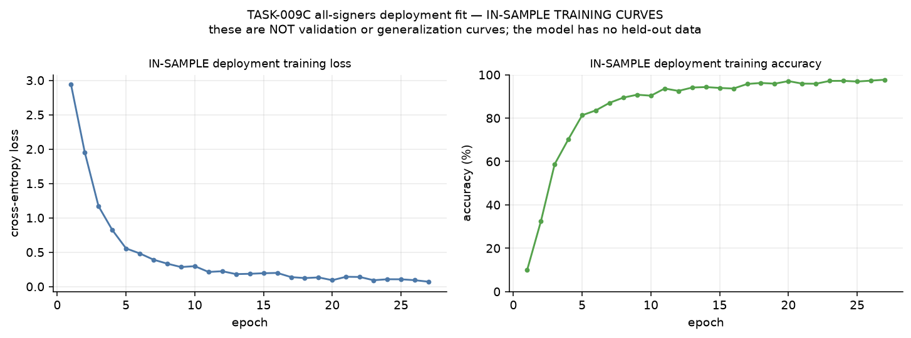

# TASK-009C — All-Signers Core-28 Deployment Model: Final Verification

> **Verified deployment artifact.** The all-signers training is complete and its
> checkpoint has been verified against the frozen plan. This report contains **no
> deployment accuracy**, and by construction never can: the model was fitted on
> every available sequence and has no held-out data.
>
> The recognition result for this project remains the **TASK-009B LOSO evidence:
> 67.63% mean held-out-signer accuracy, 0.6607 mean macro F1.**

## Purpose

TASK-009B answered the scientific question — *does the virtual-glove
representation generalize to an unseen signer?* TASK-009C answers the engineering
question — *what single model do we ship for the application and demo?* — by
fitting the already-selected configuration on all 4,222 Core-28 sequences.

This report verifies that the run produced a valid, reproducible, honestly
labelled artifact. It creates no new benchmark and never evaluates the model on
the data it was fitted to and calls the result generalization.

## Frozen configuration

Verified against both the persisted plan and the checkpoint's own metadata:

| Setting | Value |
| --- | --- |
| Contract | `task009a_sequence_input_v1` |
| `feature_set` | `full` |
| `quaternion_policy` | `absolute` |
| `pooling` | `masked_mean` |
| `input_policy` | `values_and_feature_valid` |
| Model input dimension | **92** (46 values ‖ 46 validity flags) |
| `hidden_size` / `num_layers` | 192 / 2 |
| `dropout` | 0.3 |
| `bidirectional` / `input_projection` | false / none |
| Parameters | **521,500** |
| Classes | 28 |
| Optimizer | AdamW, lr 1e-3, weight decay 1e-4 |
| Gradient clipping | 5.0 |
| Batch size | 32 |
| Loss | unweighted cross-entropy |
| Seed | 1337 |

**The persisted plan is byte-identical to the plan committed at
`reports/recognition/TASK-009C-deployment-plan.json` before training began.**
Nothing drifted between freezing and running.

## Frozen epoch policy

| Fold | primary LOSO best epoch |
| --- | ---: |
| S01 | 28 |
| S02 | 20 |
| S03 | 27 |
| **median → frozen budget** | **27** |

Policy `median_primary_loso_best_epoch`, frozen in `deployment_plan.json` before
training. Those best epochs were selected on legitimate TASK-009B validation data
before any test set was touched, so the deployment stopping point is derived
entirely from evidence already spent — never from watching deployment training
loss.

**The final checkpoint is epoch 27 because the budget said so.** It is a
coincidence, and not a selection criterion, that epoch 27 also happens to hold the
run's lowest loss and highest training accuracy; no epoch was chosen from those
values.

## Data scope

| Property | Value |
| --- | --- |
| Training sequences | **4,222 / 4,222** |
| Rejected at plan time | **0** |
| Signers | 01: 1,402 · 02: 1,401 · 03: 1,419 |
| Classes | 28 / 28 |
| Held-out data | **none** |

## Training completion

| Check | Result |
| --- | --- |
| `status.json` | **COMPLETE** |
| `deployment_plan.json`, `history.json`, `training_summary.json` | present |
| `deployment.pt`, `last.pt` | present |
| Epochs planned / completed | **27 / 27** |
| Extra epochs | none |
| Missing epochs | none |
| Duplicate epochs from a resume | none |
| `smoke_mode` | **false** |
| Partial-run marker | none |
| Wall time | 188.5 s (**3 m 8 s**) |
| Seconds per epoch | 6.98 s |
| Peak GPU memory | 85.8 MiB of 4,096 MiB |
| Environment | Python 3.14.4, torch 2.13.0+cu130, RTX 3050 Laptop |
| Code commit at training time | `0519578e441ce38b1f9707a444098f57e5ed6854` |

The measured 6.98 s/epoch and 188 s total fall inside the 7–8 s/epoch and 3–5
minute estimate published before the run.

## Training history

27 entries, epochs 1…27 exactly, contiguous, no duplicates, every loss and
accuracy finite and in range.

| | initial (epoch 1) | final (epoch 27) | best |
| --- | ---: | ---: | ---: |
| Training loss | 2.9380 | **0.0703** | 0.0703 (epoch 27) |
| Training accuracy | 9.97% | **97.70%** | 97.70% (epoch 27) |

Loss rose between consecutive epochs 8 times out of 26 transitions — ordinary
mini-batch noise on a run that fell from 2.94 to 0.07 overall, not instability.



**These are IN-SAMPLE training curves.** They are not validation curves and not
generalization curves, and they are labelled as such in the figure itself.

## Checkpoint metadata

Loaded through the existing `load_checkpoint`; every field verified:

| Field | Value |
| --- | --- |
| `schema_version` | `task009b_checkpoint_v1` (unchanged — no new format invented) |
| `contract_version` | `task009a_sequence_input_v1` |
| `experiment.fold` | **`"all"`** — not a fold number; there is no held-out signer |
| `experiment.seed` | 1337 |
| `input_dim` / `num_classes` | 92 / 28 |
| `epoch` | 27 |
| **`best_metric_name`** | **`not_applicable_fixed_epoch_budget`** |
| `extra.training_role` | `deployment_all_signers` |
| `extra.training_scope` | `all_core28_sequences` |
| `extra.training_samples` | 4222 |
| `extra.signers` | `["01", "02", "03"]` |
| `extra.classes` | 28 |
| `extra.epoch_policy` | `median_primary_loso_best_epoch` |
| `extra.deployment_epochs` / `epochs_completed` | 27 / 27 |
| `extra.source_primary_best_epochs` | `{"01": 28, "02": 20, "03": 27}` |
| `extra.held_out_data` | `"none -- fitted on every available sequence"` |
| `extra.scientific_status` | carries the POST-EVALUATION DEPLOYMENT TRAINING disclaimer |
| `extra.loso_reference` | the TASK-009B numbers, travelling with the checkpoint |
| `extra.source_task009b_analysis_commit` | `0ddf0e6fed31a08753b0d7a20ece7b5a5cdc953b` |

**`best_metric_name` is not `validation_macro_f1`.** A fixed-budget model selected
nothing, so claiming a selection metric would be a lie encoded in the artifact.
The verifier fails explicitly if that value ever appears, and equally if the
checkpoint is labelled with a fold number.

## Checkpoint SHA-256

```
deployment.pt   e3df0f007c542d15a6ff4a7ad090d6a8af58b583357ca1905c4cdcb20c82ad1e
```

Supporting artifacts:

| File | SHA-256 |
| --- | --- |
| `deployment_plan.json` | `e19dfef292d48da844311413a73a7ac456eb21e03871bccf971a33e28666ebc8` |
| `training_summary.json` | `6161a545f90915051c028a59afa51bd657b5a018b829e2ea4100cd8753cde37c` |
| `history.json` | `2b30412a4b8c0a7662bea8119404254268d97109cd70b42e46e2463595a97d15` |

## Model size

| Property | Value |
| --- | --- |
| `deployment.pt` | **6,273,578 bytes (5.98 MiB)** |
| `last.pt` (resume state, not the artifact) | 6,286,458 bytes |
| Parameters | 521,500 |
| Input dimension | 92 |
| Classes | 28 |
| Epoch | 27 |
| Seed | 1337 |

## `SequenceRecognizer` compatibility

Probe sequence chosen **deterministically before any prediction was seen**: row 0
of the frozen index, `karsl_core28_s01_sign0032_test_rep001` (signer 01, 29
frames, true label ا / SignID 0032).

| Checkpoint | Loads | Prediction | Confidence | 28 logits | Label mapping |
| --- | --- | --- | ---: | --- | --- |
| TASK-009C `deployment.pt` | **yes** | ا (0032) | 0.9996 | yes, sums to 1.000000 | consistent |
| TASK-009B research `best.pt` (fold 01) | **yes** | خ (0038) | 0.9982 | yes, sums to 1.000000 | consistent |

Both load through the **same unchanged** `SequenceRecognizer`, so backwards
compatibility with research checkpoints is preserved and no runtime change is
required.

**The two predictions are not comparable, and neither is a performance estimate.**
This sequence is *in-sample* for the deployment model — it was one of the 4,222 it
was fitted on, so recalling it correctly is expected and means nothing about
quality. For the fold-01 research checkpoint the same sequence is *held out*
(signer 01 was that fold's test signer), so its error is a single held-out
mistake, consistent with that model's 56.78% held-out accuracy but far too small a
sample to say anything on its own. The probe verifies plumbing — load, tensorize,
28 logits, authoritative Arabic label resolution — and nothing else.

## TASK-009B scientific reference

The generalization evidence for this configuration, unchanged and not superseded:

| | S01 | S02 | S03 | **mean** |
| --- | ---: | ---: | ---: | ---: |
| Held-out-signer accuracy | 56.78% | 74.16% | 71.95% | **67.63%** |
| Held-out-signer macro F1 | 0.5441 | 0.7307 | 0.7073 | **0.6607** |

### The distinction that must not be blurred

| | TASK-009B | TASK-009C |
| --- | --- | --- |
| Data | LOSO, one signer held out per fold | all 4,222 sequences |
| Held-out data | an entire unseen signer | **none** |
| Number to quote | **67.63% / 0.6607 held-out** | **final in-sample training accuracy 97.70%** |

**Correct phrasing:** *final in-sample training accuracy = 97.70%.*
**Never:** *deployment accuracy = 97.70%.*

The 30-point difference between 97.70% and 67.63% is the expected gap between
recalling data you were fitted on and recognizing a signer you have never seen. It
is not evidence that the deployment model is better than the LOSO models; it is
evidence of what in-sample measurement means.

## Limitations

1. **No held-out estimate exists for this checkpoint, and none can be produced
   from this data.** Every sequence was used for fitting. The only performance
   evidence is the TASK-009B LOSO result for the same configuration.
2. **The deployment model is not the LOSO model.** It shares the configuration
   and the recipe, but it saw 1.78× more data and every signer, so its behaviour
   is not identical to any evaluated fold.
3. **Three signers.** A genuinely new signer's performance is bounded by the same
   high-variance three-fold estimate (56.78%–74.16% across folds).
4. **Epoch budget is a median of epochs, not steps.** The LOSO best epochs were
   measured on 2,372 sequences per fold while this trained on 4,222, so 27 epochs
   here is 1.78× the gradient steps of 27 epochs there. The frozen rule was
   applied as specified and the consequence disclosed in the plan, not silently
   adjusted after the fact.
5. **97.70% in-sample accuracy does not confirm the budget was right.** A longer
   budget would push it higher without necessarily improving generalization; the
   budget cannot be validated from this run, only from evidence that predates it.
6. **Simulated glove.** These remain WiLoR-derived virtual sensors; no physical
   hardware noise, drift or calibration is represented.
7. **Single seed.** One deployment fit at seed 1337; no seed variation was
   measured.

## Deployment usage

```python
from recognition.models import SequenceRecognizer

recognizer = SequenceRecognizer.from_checkpoint(
    "/home/hatim/graduation-project-runs/task009c-core28-deployment/deployment.pt",
    label_table="datasets/manifests/karsl_core28_labels.csv",
    device="cuda",  # or "cpu"
)
prediction = recognizer.predict_sequence(arrays)   # TASK-009A virtual-glove arrays
prediction.label_ar, prediction.sign_id, prediction.confidence
```

The recognizer reads the feature set and quaternion policy from the checkpoint, so
a caller cannot feed it the wrong tensorization. A runtime that wants to display
provenance can read `extra.training_role` to distinguish the deployment model from
a research fold model — an additive, non-breaking read.

Any interface that surfaces a confidence number should not present it as
calibrated: nothing in this project has measured calibration.

## Reproducibility

```bash
cd /home/hatim/Graduation-Project-Simulation-task009c

# Re-verify the persisted artifact (reads only; trains nothing).
PYTHONPATH=. python scripts/run_task009c_verify_deployment.py \
  --run-root /home/hatim/graduation-project-runs/task009c-core28-deployment \
  --data-run-root /home/hatim/graduation-project-runs/task008-core28-full

# Confirm the checkpoint hash independently.
sha256sum /home/hatim/graduation-project-runs/task009c-core28-deployment/deployment.pt

# Tests.
PYTHONPATH=. python -m unittest discover -s tests -p "test_*.py"
python -m compileall -q recognition scripts tests
```

Machine-readable manifest: `reports/recognition/TASK-009C-deployment-artifact.json`.
Frozen plan copy: `reports/recognition/TASK-009C-deployment-plan.json`.
Infrastructure and epoch-policy rationale:
`reports/recognition/TASK-009C-deployment-training-infrastructure.md`.

## Verification summary

| Check | Result |
| --- | --- |
| Files present and non-empty | **PASS** (6 / 6) |
| Status COMPLETE, 27/27 epochs, not smoke | **PASS** |
| Plan matches the committed frozen copy | **PASS** (byte-identical) |
| History: 27 contiguous finite epochs, no duplicates | **PASS** |
| Checkpoint metadata honest and complete | **PASS** |
| `SequenceRecognizer` loads `deployment.pt` | **PASS** |
| `SequenceRecognizer` still loads research `best.pt` | **PASS** |
| Problems found | **0** |
| Tests | 676 passed, 0 failed |
| compileall | 0 errors |

**TASK-009C DEPLOYMENT MODEL COMPLETE — READY FOR APPLICATION DEPLOYMENT**
